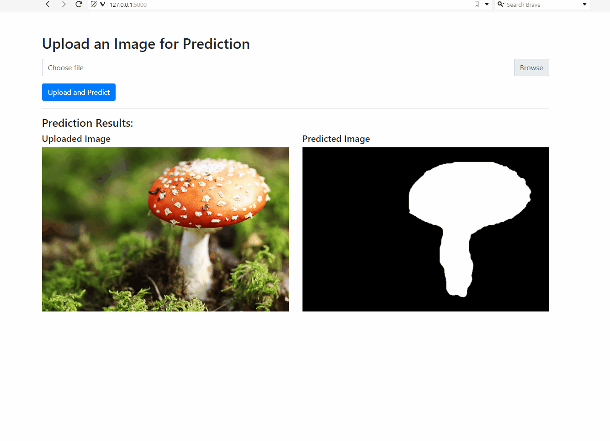

### Interactive Segmentation Visualization



This project includes a mini-application built with Flask, allowing for interactive visualization of image segmentation. The application provides a user-friendly interface where you can upload images and view the model's segmentation predictions, facilitating more tangible interaction with the model's capabilities.

#### Running the Flask Application

To launch the application, navigate to the directory containing `app.py` and execute the following command:

```sh
python app.py
```

This command starts a local development server, making the application accessible via a web browser at the address `http://127.0.0.1:5000/` or `http://localhost:5000/`.

#### Using the Application

Once you access the application, you'll find an option to upload an image. After uploading, the system processes the image, and the segmentation model generates predictions, displaying the segmented regions of the image.

The application is structured as follows:

- `app.py`: The main file that runs the Flask server and handles the uploading and processing of images.
- `predict.py`: Responsible for processing the uploaded images through the YOLO model and generating segmentation predictions.

Both these scripts utilize functions from the YOLOv8 model for image segmentation, ensuring accurate and efficient predictions.

### Data Preparation and Processing Pipeline

This repository contains scripts for setting up and processing datasets to prepare for machine learning training. The pipeline involves downloading datasets, sorting and organizing data, preparing masks, and setting up training and testing datasets.

## Scripts and Functions

### 1. `download-pipeline.sh`

This is the main executable script that prepares and organizes the datasets for further processing. The script performs several key functions as outlined below:

- **Setting and Sorting Downloads**: Invokes Python scripts to download and sort images and their corresponding masks.
- **Preparing Masks**: Processes the downloaded masks and converts them into a suitable format for machine learning models.
- **Preparing Training and Testing Data**: Organizes the data into training and testing sets, ensuring they are in the right directories for easy access during model training.

### 2. `set_download.py`

This Python script uses the FiftyOne package to download specific segments of the Open Images V7 dataset. It is designed to download a subset of images based on specified classes and attributes.

### 3. `sort_download.py`

This Python script organizes the downloaded data by sorting the masks corresponding to the images. It employs multiprocessing to expedite the sorting process and ensures that each image file from the dataset has its corresponding mask.

## Usage

To execute the pipeline, you need to run the `download-pipeline.sh` script. However, ensure you have the necessary Python environment and dependencies set up for the Python scripts to execute successfully.

```sh
bash download-pipeline.sh
```

## Dependencies

- Python 3
- Bash shell (for executing .sh scripts)
- [FiftyOne](https://voxel51.com/docs/fiftyone/)

Ensure that all dependencies are installed and properly configured before running the scripts.

## Directory Structure

After the successful execution of the scripts, Move the "code" directory up one level into the image-segmentation-yolov8 folder. Your directory structure should look something like this:


```

image-segmentation-yolov8
├── code
│   ├── images
│   │   ├── train
│   │   └── val
│   └── labels
│       ├── train
│       └── val
├── download-pipeline
│   ├── extracted_labels
│   ├── extracted_masks
│   └── open-images-v7
│       └── train
│           ├── data
│           └── labels
├── flask_backend
│   └── ... (additional files and directories for the Flask backend)
├── runs
├── downloader.py
├── predict.py
└── ... (other miscellaneous files and directories)


```

## Notes

- The scripts are configured to process images and masks for the "Mushroom" class as a demonstration. You can modify the `set_download.py` script to specify different classes as needed.
- The sorting script assumes a specific structure of the dataset. If your dataset directory structure differs, you may need to adjust the script accordingly.
- Ensure you have enough disk space for the datasets and the processed files.

## Troubleshooting

If you encounter any errors during the execution of the scripts, check the following:

1. **Environment Configuration**: Ensure your Python environment is set up correctly and all required packages are installed.
2. **File Permissions**: Make sure that the `download-pipeline.sh` script has the necessary execution permissions. You can set this with the command `chmod +x download-pipeline.sh`.
3. **Disk Space**: Verify you have sufficient disk space on your machine to handle the data download and processing.

## Contributing

If you wish to contribute to the development and improvement of this pipeline, feel free to fork the repository and submit pull requests.

## Special thanks
This project is based on foundational work from the "Computer Vision Engineer" YouTube channel's repository. Their initial efforts laid the groundwork for this work in image segmentation. You can find the repository here: https://github.com/computervisioneng/image-segmentation-yolov8
